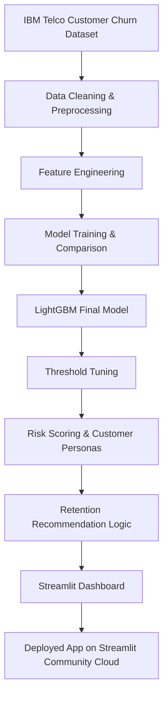
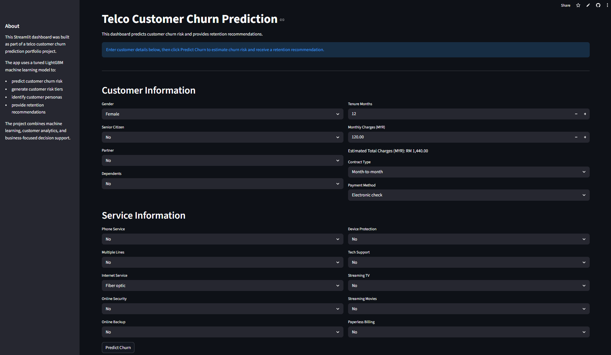
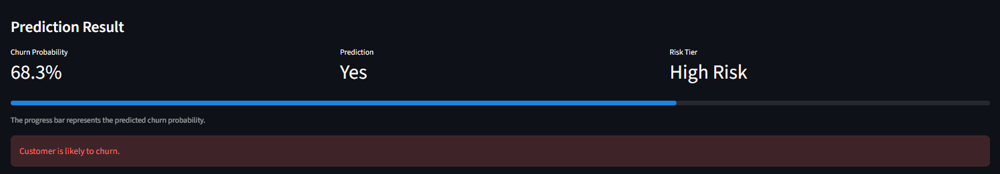

# Telco Customer Churn Prediction and Retention Strategy

## 📌 Project Overview

Customer churn is a major challenge in the telecommunications industry, directly impacting revenue, customer lifetime value, and long-term business growth.

This project uses machine learning to predict customer churn risk and transform those predictions into actionable retention strategies through customer segmentation, risk scoring, and business-focused decision support.

The project was developed as an end-to-end machine learning workflow covering:

- data cleaning and preprocessing  
- exploratory data analysis (EDA)  
- feature engineering  
- model training and evaluation  
- explainability analysis  
- customer prioritization  
- retention strategy simulation  
- dashboard deployment  

The final solution includes an interactive Streamlit dashboard that allows users to generate real-time churn predictions and retention recommendations.

---

## 🌐 Live Dashboard

Streamlit App:  
https://myrazd-telco-churn.streamlit.app/

---

## 🎯 Project Objectives

- Analyze customer behavior and identify churn-related patterns  
- Build and evaluate machine learning models for churn prediction  
- Identify the key drivers influencing customer churn  
- Develop customer risk scoring and prioritization frameworks  
- Simulate business-focused retention strategies  
- Deploy an interactive machine learning dashboard  

---

## 🚀 Dashboard Features

The deployed Streamlit dashboard allows users to:

- Input customer information  
- Predict customer churn probability  
- Generate churn risk tiers  
- Identify customer personas  
- Receive retention recommendations  

The dashboard was built using Streamlit and deployed through Streamlit Community Cloud.

---

## 📂 Dataset

The project uses the IBM Telco Customer Churn dataset.

Dataset source:  
https://shorturl.at/bMSrL

The dataset is not included in this repository due to licensing considerations.

---

## ⚙️ Project Workflow

### Phase 1: Data Preparation and Feature Engineering

- Data overview and cleaning  
- Exploratory data analysis (EDA)  
- Missing value handling  
- Feature selection and leakage removal  
- Advanced feature engineering  

### Phase 2: Machine Learning Modeling

- Logistic Regression  
- Decision Tree  
- Random Forest  
- XGBoost  
- LightGBM  
- Model comparison  
- Threshold tuning  

### Phase 3: Explainability and Business Analytics

- SHAP explainability analysis  
- Customer risk scoring  
- Customer persona analysis  
- Customer value segmentation  
- ROI simulation  
- Customer prioritization  
- Retention recommendations  

### Phase 4: Advanced Evaluation and Deployment

- Advanced evaluation metrics and visualizations  
- Hyperparameter tuning  
- Cross-validation  
- Streamlit dashboard development  
- Deployment preparation  

---

## 🤖 Models Used

- Logistic Regression  
- Decision Tree  
- Random Forest  
- XGBoost  
- LightGBM  

---

## 🧠 Advanced Machine Learning Techniques

The project was extended with several advanced machine learning and business analytics techniques:

- Feature engineering  
- Threshold tuning  
- Hyperparameter tuning  
- Cross-validation  
- SHAP explainability analysis  
- Customer risk scoring  
- Customer persona analysis  
- Customer value segmentation  
- ROI simulation  
- Retention prioritization  

---

## 📈 Model Evaluation Summary

Multiple machine learning models were evaluated for churn prediction performance.

Among the evaluated models, LightGBM delivered the strongest overall balance among precision, recall, and F1 Score while maintaining good generalization during cross-validation.

Threshold tuning was also applied to improve churn detection performance by balancing customer retention coverage and targeting precision.

---

## 💡 Key Insights

- Customers with shorter tenure were significantly more likely to churn.  
- Fiber optic customers demonstrated higher churn risk.  
- Electronic check payment users showed elevated churn probability.  
- Support-related services were associated with improved customer retention.  
- High-value customers with high churn probability represented the most critical retention segment.  
- Customer personas revealed distinct churn behaviors across customer groups.  
- ROI simulations suggested that targeted retention campaigns could generate substantial business value.  

---

## 🧠 Business Recommendations

- Prioritize retention campaigns for high-value customers with high churn risk.  
- Encourage customers to transition toward longer-term contracts through loyalty incentives.  
- Improve onboarding and engagement strategies for newer customers.  
- Review pricing and service quality for fiber optic customers.  
- Promote support-related services to improve customer retention.  
- Apply customer prioritization and ROI analysis before launching retention campaigns.  
- Use churn risk tiers to allocate retention resources more efficiently.  

---

## ☁️ Deployment

The final machine learning dashboard was deployed using:

- Streamlit  
- Streamlit Community Cloud  
- GitHub  

The deployment includes:

- serialized LightGBM model  
- interactive user input interface  
- real-time churn prediction  
- customer risk scoring  
- customer persona identification  
- business-focused retention recommendations  

---

## 🛠️ Tools and Libraries

- Python  
- Pandas  
- NumPy  
- Matplotlib  
- Seaborn  
- Scikit-learn  
- XGBoost  
- LightGBM  
- SHAP  
- Streamlit  
- Joblib  

---

## 🏗️ Project Architecture

---

## 📸 Dashboard Preview

### Main Dashboard

### Prediction Results

### Risk Tier and Recommendations

---

## ✅ Conclusion

This project evolved beyond a standard churn prediction workflow by combining machine learning, explainability analysis, business-focused customer analytics, and interactive deployment.

In addition to predictive modeling, the project included customer segmentation, prioritization, risk scoring, retention strategy simulation, and decision-support recommendations to deliver a more practical, business-oriented solution.

Overall, the project demonstrates how machine learning can be applied not only to predict customer churn but also to support retention strategy planning and customer-focused business decision-making through an end-to-end deployed analytics workflow.
